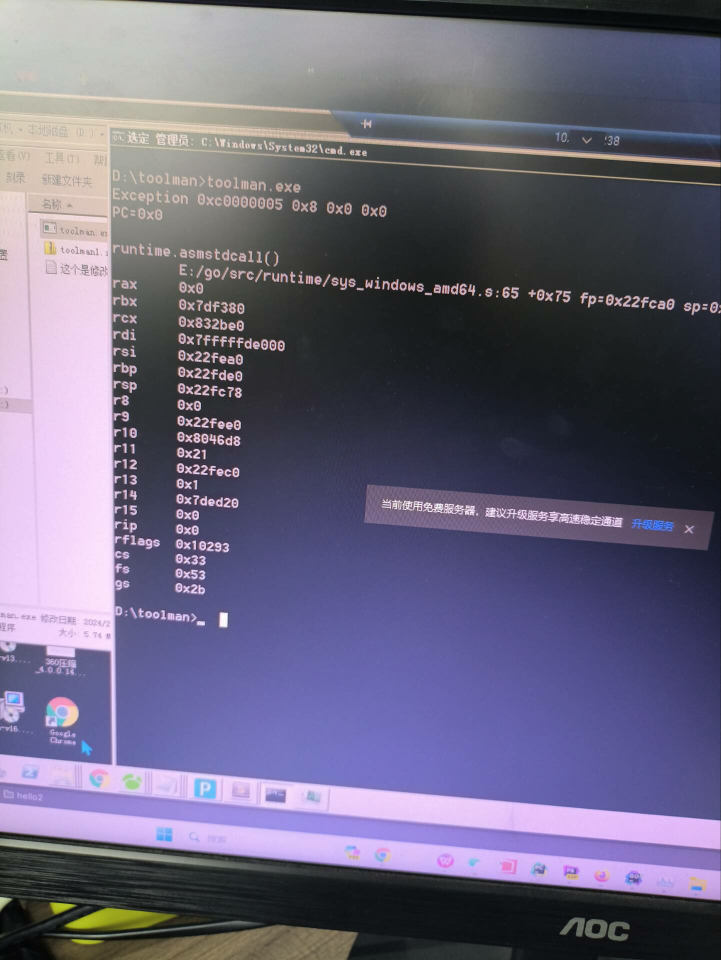

### 做什么
1. 要写个脚本给先上的夫服务改密码
2. 因为php版本太老了，还是5.x的，不好用

### 遇到的问题
1. 打包之后本地能运行，但是在线上就不行了
2. 线上是win server2008
3. 错误

### 询问群友
1. 因为win server 2008 是在win 7 上面改的
2. 但是我使用的go版本是1.22
3. 从1.22版本不支持win 7....
